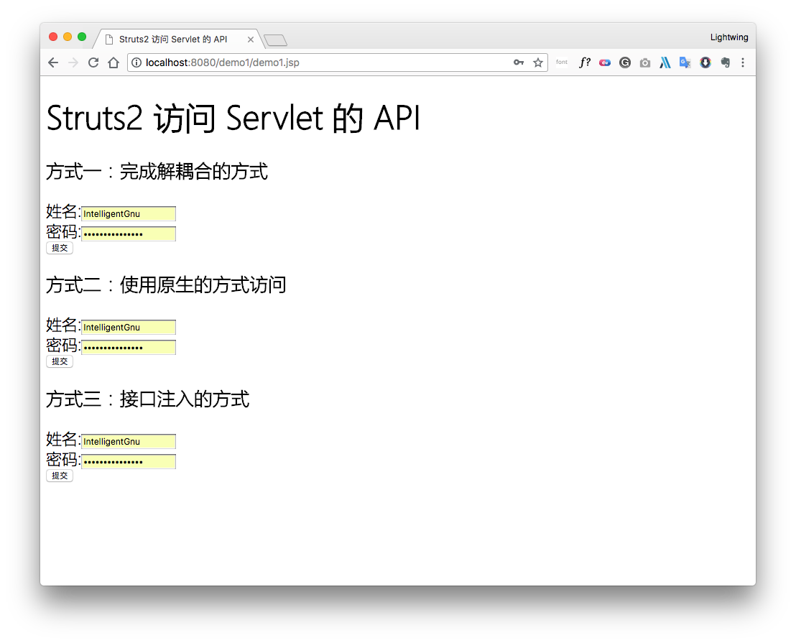
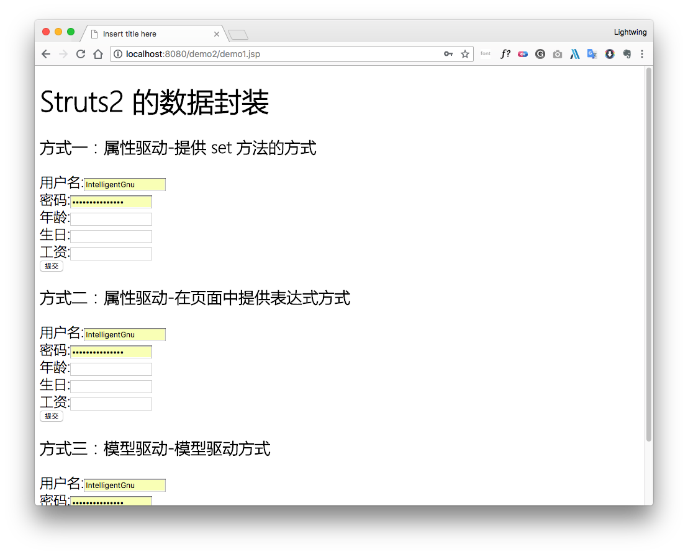
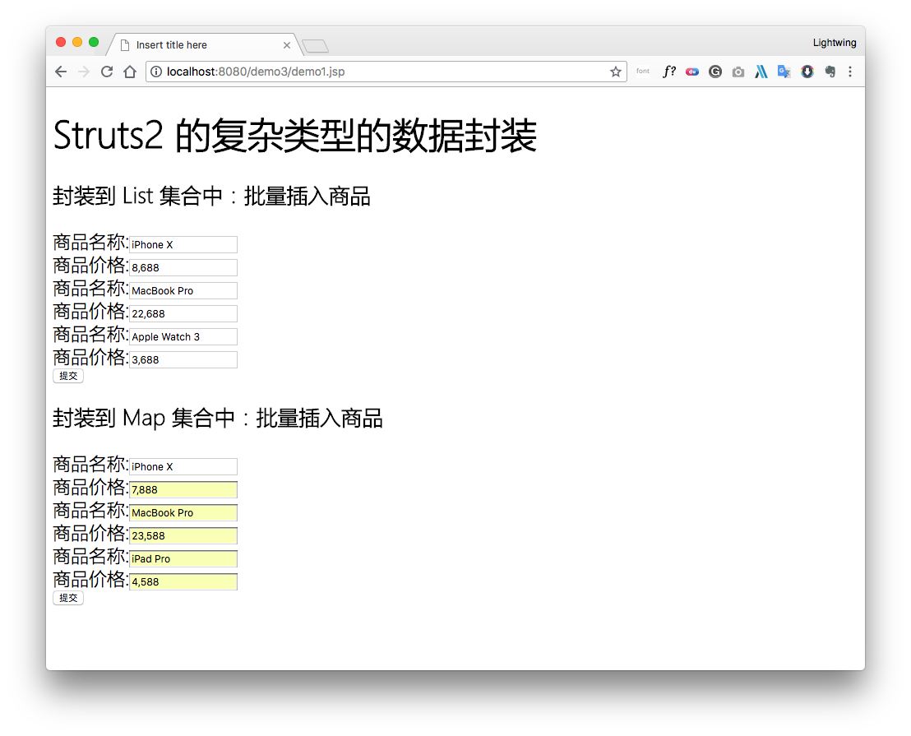

## 第1章 Struts2_day02笔记

### 1.1 上次课内容回顾

### 1.2 Struts2 的 Servlet 的 API 的访问

​	在使用 Struts2 的框架的过程中，发现 Struts2 和 Servlet 的 API 是解耦合的。在实际开发中，经常使用到 Servlet 的 API，比如进行登录，将用户的信息保存到 Session 中，有的时候需要向页面输出一些内容，用到 response 对象。涉及到 Servlet 的 API 的访问。

#### 1.2.1 `Struts2` 的 `Servlet` 的 API 的访问



##### 1.2.1.1 完全解耦合的方式

###### 1. 编写 `JSP`

```jsp
<form action="${ pageContext.request.contextPath }/requestDemo1.action" method="post">
    姓名:<input type="text" name="name"/><br/>
    密码:<input type="password" name="password"><br/>
    <input type="submit" value="提交">
</form>
```

###### 2. 编写 `Action`

```java
public class RequestDemo1 extends ActionSupport {
    @Override
    public String execute() throws Exception {
        // 1.接收数据
        // 利用 Struts2 中的对象 ActionContext
        HttpServletRequest request = ServletActionContext.getRequest();
        Map<String, String[]> map = request.getParameterMap();
        for (String key : map.keySet()) {
            String[] values = map.get(key);
            System.out.println(key + " " + Arrays.toString(values));
        }

        // 2. 向对象中保存数据
        request.setAttribute("reqName", "reqValue");
        // 3. 向 application 保存数据
        ServletActionContext.getServletContext().setAttribute("appName", "appValue");
        return SUCCESS;
    }
}
```

*****注意：这种方式只能获得代表 request、session、application 的数据的 `Map` 集合，不能操作这些对象的本身的方法。

##### 1.2.1.2 使用 `Servlet` 的 API 的原生方式（*********）

###### 1. 编写 `JSP`

```jsp
<h3>方式二：使用原生的方式访问</h3>
<form action="${ pageContext.request.contextPath }/requestDemo2.action" method="post">
    姓名:<input type="text" name="name"/><br/>
    密码:<input type="password" name="password"><br/>
    <input type="submit" value="提交">
</form>
```

###### 2. 编写 `Action`

```java
public class RequestDemo2 extends ActionSupport {
    @Override
    public String execute() throws Exception {
        // 1. 接收参数：
        // 利用 Struts2 中的对象 ActionContext 对象
        ActionContext context = ActionContext.getContext();

        // 调用 ActionContext 中的方法。
        // 类似于 Map<String,String[]> request.getParameterMap();
        Map<String, Object> map = context.getParameters();
        for (String key : map.keySet()) {
            String[] values = (String[]) map.get(key);
            System.out.println(key + " " + Arrays.toString(values));
        }

        // 2. 向域对象中存入数据
        context.put("reqName", "reqValue");
        context.getSession().put("sessName", "sessValue");
        context.getApplication().put("appName", "appValue");

        return SUCCESS;
    }
}
```

***** 注意：这种方式可以操作域对象的数据，同时也可以获得对象的方法。

##### 1.2.1.3 接口注入的方式

###### 1. 编写 `JSP`

```jsp
<h3>方式三：接口注入的方式</h3>
<form action="${ pageContext.request.contextPath }/requestDemo3.action" method="post">
    姓名:<input type="text" name="name"/><br/>
    密码:<input type="password" name="password"><br/>
    <input type="submit" value="提交">
</form>
```

###### 2. 编写 `Action`

```java
/**
 * 访问Servlet的API的方式三：接口注入的方式
 *
 * @author LightwingNg
 */
public class RequestDemo3 extends ActionSupport implements ServletRequestAware, ServletContextAware {
    private HttpServletRequest request;
    private ServletContext context;

    public RequestDemo3() {
        super();
        System.out.println("RequestDemo3被创建了...");
    }

    @Override
    public String execute() throws Exception {
        // 1. 接收参数
        // 通过接口注入的方式获得 request 对象。
        Map<String, String[]> map = request.getParameterMap();
        for (String key : map.keySet()) {
            String[] values = map.get(key);
            System.out.println(key + " " + Arrays.toString(values));
        }
        // 2. 向域对象中保存数据
        // 向 request 域中保存数据
        request.setAttribute("reqName", "reqValue");
        // 向 session 中保存数据:
        request.getSession().setAttribute("sessName", "sessValue");
        // 向 application 中保存数据:
        context.setAttribute("appName", "appValue");

        return super.execute();
    }

    @Override
    public void setServletRequest(HttpServletRequest request) {
        this.request = request;
    }

    @Override
    public void setServletContext(ServletContext context) {
        this.context = context;
    }
}
```

​	Servlet 是单例的，多个程序访问同一个 Servlet 只会创建一个 Servlet 的实例。Action 是多例的，一次请求，创建一个 Action 的实例（**不会出现线程安全的问题**）。

### 1.3 `Struts2` 的结果页面的配置

#### 1.3.1 结果页面的配置

##### 1.3.1.1 全局结果页面

​	全局结果页面：全局结果页面指的是，在包中配置一次，其他的在这个包中的所有的 action 只要返回了这个值，都可以跳转到这个页面。

```jsp
<global-results>
	<result>/demo1/demo2.jsp</result>
</global-results>
```

**针对这个包下的所有的 action 的配置都有效。**

##### 1.3.1.2 局部结果页面

​	局部结果页面：局部结果页面指的是，只能在当前的 action 中的配置有效。

```jsp
<action name="requestDemo1" class="com.lightwing.struts2.demo1.RequestDemo1">
	<result type="redirect">/demo1/demo2.jsp</result>
</action>
```

**针对当前的 action 有效。**

##### 1.3.2 result 标签的配置

##### 1.3.2.1 result 标签的配置

###### result 标签用于配置页面的跳转。在 result 标签上有两个属性：

- `name` 属性：逻辑视图的名称。默认值：`success`
- `type` 属性：页面跳转的类型。
	- `dispatcher`：默认值，请求转发。（Action 转发 JSP）
	- `redirect`：重定向。（Action 重定向 JSP）
	- `chain`：转发。（Action 转发 Action）
	- `redirectAction`：重定向。（Action 重定向 Action）
	- `stream`：Struts2 中提供文件下载的功能。

### 1.4 `Struts2` 的数据的封装

​	Struts2 框架是一个 Web 层框架（框架：软件的办成品，完成一部分功能）。Struts2 提供了数据封装的功能。

#### 1.4.1 Struts2 的数据封装



##### 1.4.1.1 属性驱动：提供属性 `set` 方法的方式（不常用）

###### 1. 编写 `JSP`

```jsp
<h3>方式一：属性驱动-提供 set 方法的方式</h3>
<s:fielderror/>
<form action="${ pageContext.request.contextPath }/userAction1.action" method="post">
    用户名:<input type="text" name="username"/><br/>
    密码:<input type="password" name="password"><br/>
    年龄:<input type="text" name="age"/><br/>
    生日:<input type="text" name="birthday"/><br/>
    工资:<input type="text" name="salary"/><br/>
    <input type="submit" value="提交">
</form>
```

###### 2. 编写 `Action`

```java
public class UserAction1 extends ActionSupport {
    // 提供了对应的属性
    private String username;
    private String password;
    private Integer age;
    private Date birthday;
    private Double salary;

    public void setUsername(String username) {
        this.username = username;
    }

    public void setPassword(String password) {
        this.password = password;
    }

    public void setAge(Integer age) {
        this.age = age;
    }

    public void setBirthday(Date birthday) {
        this.birthday = birthday;
    }

    public void setSalary(Double salary) {
        this.salary = salary;
    }

    @Override
    public String execute() {
        // 接收数据:
        System.out.println(username);
        System.out.println(password);
        System.out.println(age);
        System.out.println(birthday);
        System.out.println(salary);

        // 封装数据:
        User user = new User();
        user.setUsername(username);
        user.setPassword(password);
        user.setAge(age);
        user.setBirthday(birthday);
        user.setSalary(salary);
        return NONE;
    }
}
```

##### 1.4.1.2 属性驱动：页面中提供表达式方式

###### 1. 编写 `JSP`

```jsp
<h3>方式二：属性驱动-在页面中提供表达式方式</h3>
<form action="${ pageContext.request.contextPath }/userAction2.action" method="post">
    用户名:<input type="text" name="user.username"/><br/>
    密码:<input type="password" name="user.password"><br/>
    年龄:<input type="text" name="user.age"/><br/>
    生日:<input type="text" name="user.birthday"/><br/>
    工资:<input type="text" name="user.salary"/><br/>
    <input type="submit" value="提交">
</form>
```

###### 2. 编写 `Action`

```java
/**
 * 数据封装的方式二：属性驱动-在页面中提供表达式的方式
 *
 * @author jt
 */
public class UserAction2 extends ActionSupport {
    // 提供一个 User 对象:
    private User user;

    // 提供 user 的 set 和 get 方法：一定要提供 get 方法。
    // 因为拦截器完成数据封装，需要创建 User 对象。通过 get 方法可以获得同一个对象，将数据封装到同一个对象中。
    public User getUser() {
        return user;
    }

    public void setUser(User user) {
        this.user = user;
    }

    @Override
    public String execute() {
        System.out.println(user);
        return NONE;
    }
}
```

##### 1.4.1.3 模型驱动：采用模型驱动方式（最常用）

###### 1. 编写 `JSP`

```jsp
<h3>方式三：模型驱动-模型驱动方式</h3>
<form action="${ pageContext.request.contextPath }/userAction3.action" method="post">
    用户名:<input type="text" name="username"/><br/>
    密码:<input type="password" name="password"><br/>
    年龄:<input type="text" name="age"/><br/>
    生日:<input type="text" name="birthday"/><br/>
    工资:<input type="text" name="salary"/><br/>
    <input type="submit" value="提交">
</form>
```

###### 2. 编写 `Action`

```java
/**
 * 数据封装的方式三：模型驱动-采用模型驱动的方式
 *
 * @author jt
 */
public class UserAction3 extends ActionSupport implements ModelDriven<User> {
    // 模型驱动使用的对象：前提必须手动提供对象的实例
    private User user = new User();

    @Override
    // 模型驱动需要使用的方法:
    public User getModel() {
        return user;
    }

    @Override
    public String execute() {
        System.out.println(user);
        return NONE;
    }
}
```

###### 模型驱动方式最常用的方式：

- 缺点：只能同时向一个对象中封装数据。


###### 使用第二种可以向多个对象中同时封装数据：

#### 1.4.2 关于 `INPUT` 逻辑视图

##### 1.4.2.1 `INPUT` 的逻辑视图的配置

###### Action 接口中提供了五个逻辑视图的名称：

- `SUCCESS`

- `ERROR`

- `LOGIN`
- `INPUT`           `input` 在某些拦截器中会使用。
- `NONE`


### 1.5 `Struts2` 的复杂类型的数据封装

​	在实际开发中，有可能遇到批量向数据库中插入记录，需要在页面中将数据封装到集合中。

#### 1.5.1 `Struts2` 的复杂类型的数据封装



##### 1.5.1.1 封装数据到 `List` 集合中

###### 1. 编写 `JSP`

```jsp
<h3>封装到 List 集合中：批量插入商品</h3>
<form action="${ pageContext.request.contextPath }/productAction1.action" method="post">
    商品名称:<input type="text" name="products[0].name"><br/>
    商品价格:<input type="text" name="products[0].price"><br/>
    商品名称:<input type="text" name="products[1].name"><br/>
    商品价格:<input type="text" name="products[1].price"><br/>
    商品名称:<input type="text" name="products[2].name"><br/>
    商品价格:<input type="text" name="products[2].price"><br/>
    <input type="submit" value="提交">
</form>
```

###### 2. 编写 `Action`

```java
/**
 * 复杂类型的数据封装：封装到List集合
 *
 * @author Lightwing Ng
 */
public class ProductAction1 extends ActionSupport {
    private List<Product> products;

    // 提供集合的set方法:
    public void setProducts(List<Product> products) {
        this.products = products;
    }

    public List<Product> getProducts() {
        return products;
    }

    @Override
    public String execute() throws Exception {
        for (Product product : products) {
            System.out.println(product);
        }
        return NONE;
    }
}
```

##### 1.5.1.2 封装数据到 `Map` 集合中

###### 1. 编写 `JSP`

```jsp
<h3>封装到 Map 集合中：批量插入商品</h3>
<form action="${ pageContext.request.contextPath }/productAction2.action" method="post">
    商品名称:<input type="text" name="map['one'].name"><br/>
    商品价格:<input type="text" name="map['one'].price"><br/>
    商品名称:<input type="text" name="map['two'].name"><br/>
    商品价格:<input type="text" name="map['two'].price"><br/>
    商品名称:<input type="text" name="map['three'].name"><br/>
    商品价格:<input type="text" name="map['three'].price"><br/>
    <input type="submit" value="提交">
</form>
```

###### 2. 编写 `Action`

```java
/**
 * 复杂数据类型的封装：封装到Map集合
 *
 * @author Lightwing Ng
 */
public class ProductAction2 extends ActionSupport {
    private Map<String, Product> map;

    public Map<String, Product> getMap() {
        return map;
    }

    public void setMap(Map<String, Product> map) {
        this.map = map;
    }

    @Override
    public String execute() {
        for (String key : map.keySet()) {
            Product product = map.get(key);
            System.out.println(key + " " + product);
        }
        return NONE;
    }
}
```

### 1.6 综合练习 `CRM:` 保存客户

#### 1.6.1 环境搭建

##### 1.6.1.1 修改 `html` 改为 `JSP`

#### 1.6.2 代码实现

##### 1.6.2.1 保存操作流程

1. 点击左侧的菜单页面页面：

2. 跳转到添加页面（经过 `Action`）：

3. 在添加页面中输入指定的信息，点击「保存」

4. 将数据提交到 `Action` -> `Service` -> `DAO`

5. 最终回到列表页面


##### 1.6.2.2 第一步：修改菜单页面上链接：

##### 1.6.2.3 第二步：编写 `Action` 中的 `saveUI` 的方法

##### 1.6.2.4 第三步：配置页面跳转

##### 1.6.2.5 第四步：修改添加页面

##### 1.6.2.6 第五步：完成保存操作

###### 1. 编写 `Action`

###### 2. 编写 `Service`

###### 3. 编写 `DAO`

##### 1.6.2.7 第六步：配置页面的跳转